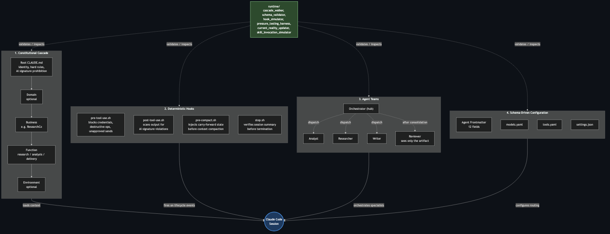

# Cortex-OS

An opinionated reference implementation for composing Claude Code's native primitives into a disciplined operating system. Not a framework to install. A pattern to fork, adapt, and inhabit.

*Diagram source: [`docs/architecture-diagram.mermaid`](docs/architecture-diagram.mermaid). Renders inline on GitHub when included as a mermaid code block.*

Four layers compose the pattern. Each layer notes what is native to Claude Code and what cortex-os adds.

1. **Cascading CLAUDE.md constitutions.** Claude Code loads CLAUDE.md hierarchically by directory. Cortex-OS adds the five-layer doctrine (root → domain → business → function → environment) and tier-graded function governance.
2. **Deterministic hooks.** PreToolUse, PostToolUse, Stop, and PreCompact are native Claude Code primitives. Cortex-OS ships hook scripts that operationalize "hooks enforce, CLAUDE.md advises," including an AI signature scanner that catches what advisory voice rules cannot.
3. **Agent teams with context-boundary discipline.** Subagents with isolated contexts and YAML frontmatter are native. Cortex-OS adds an orchestrator/analyst/writer/researcher/reviewer topology with enforced context boundaries: the reviewer never sees the development context.
4. **Schema-driven configuration with runtime validation.** Unified schema validation across the cascade, hooks, agents, models.yaml, and tools.yaml. Six Python scripts inspect and validate before Claude Code uses the configuration. This is the strongest remaining differentiator.

## Why this exists

Claude Code ships strong primitives. What it does not ship is opinionated composition: which cascade depth makes sense for a given business, which hook scripts to write, which role topology survives groupthink, which schemas to validate before runtime. Cortex-OS is one operator's answer to those questions, with the receipts.

The repository contains the pattern, a fully instantiated reference business (ResearchCo) that demonstrates the cascade in action, and six runtime scripts that let an operator verify the cascade resolves, the schemas validate, and the hooks fire on a fresh clone.

## Quick navigation

- [QUICKSTART.md](QUICKSTART.md) – thirty-minute path from fork to first working session
- [ARCHITECTURE.md](ARCHITECTURE.md) – technical deep dive on the four layers
- [docs/](docs/) – per-layer references (cascade pattern, hooks layer, agent teams, schemas)
- [_template/](_template/) – blank templates to copy into your own project
- [reference/business-example/](reference/business-example/) – ResearchCo, the worked example
- [runtime/](runtime/) – inspection and validation utilities
- [CONTRIBUTING.md](CONTRIBUTING.md) – contribution standards

## Status

Initial public release. The pattern is stable. The reference business and runtime layer are complete. A companion repository will publish the production execution pattern (LangGraph + Temporal wrapping a Cortex-OS-governed workflow) following community engagement on this one.

## Related work

In May 2026 the Claude Code reference-pattern space includes [`anthropics/claude-plugins-official`](https://github.com/anthropics/claude-plugins-official), [`VILA-Lab/Dive-into-Claude-Code`](https://github.com/VILA-Lab/Dive-into-Claude-Code), [`nateherkai/AIS-OS`](https://github.com/nateherkai/AIS-OS), and [`vanzan01/claude-code-sub-agent-collective`](https://github.com/vanzan01/claude-code-sub-agent-collective). Cortex-OS overlaps with each at different layers; the differentiator is unified schema validation across the cascade, hooks, agents, models, and tools. Detailed acknowledgments at [docs/related-work.md](docs/related-work.md).

This repository ships an [`AGENTS.md`](AGENTS.md) at the root so cross-tool agents (Codex, Copilot, Cursor, Windsurf, Amp, Devin) under the Linux Foundation Agentic AI Foundation standard can bootstrap from the cortex-os configuration.

## License, attribution, citation

MIT License. See [LICENSE](LICENSE).

Claude Code, hooks, subagents, the Skills system, and the agent frontmatter schema are Anthropic primitives documented at [docs.claude.com/claude-code](https://docs.claude.com/en/docs/claude-code); this repository composes them, it does not replace them. The RAG-triad framework referenced in the post-launch roadmap is from the TruLens project. The companion repository (LangGraph + Temporal wrapping a Cortex-OS-governed workflow) will be published separately following engagement on this one.

For citation, see [CITATION.cff](CITATION.cff). Maintained by Michael Burton. Issues and PRs welcome under [CONTRIBUTING.md](CONTRIBUTING.md); pattern additions require an approved issue first.
